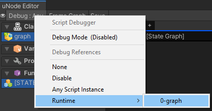
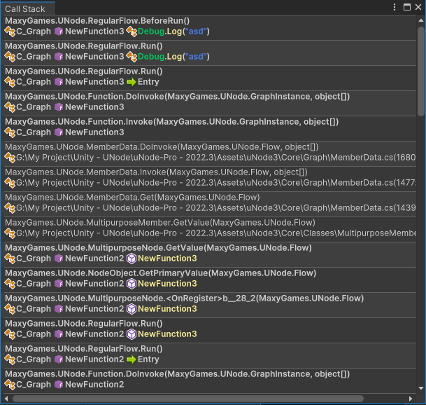

# Debugging

Debugging is an essential part of developing with uNode. It allows you to observe how your logic flows, track variable values, and identify issues by simulating execution paths. uNode offers built-in features like **Log Messages**, **Connection Tracing**, and **Breakpoints** to help you debug more effectively.

uNode supports debugging in both Runtime Graphs and C# Graphs.

## Debuggin graphs with reflection mode

For debuggin graphs with reflection mode you can directly select the 'Game Object' in heirarchy or by opening graph asset then manually select the graph instance.

For debuggin graph by selecting the Game Object in heirarchy here is the steps:
1. Select the `Game Object` that's have 'Class Component' from the Hierarchy window
2. `Navigate` to inspector
3. Click on the `Edit Graph`

For debuggin graph from the graph asset, here is the steps:

1. Open graph you want to debug
2. Click on the `Debug` from the Toolbar
3. Select the graph you want to debug

## Debuggin graphs with c# mode

Firstly before you can debug your compiled graph, you need to enable the `Debug Mode`. 
To enable the `Debug Mode` you can click on the `Debug > Script Debugger > Debug Mode`.

After that you need to re-compile the graph.

To begin debuggin the graph you can select the object instance by clicking on the `Debug > Object > 'MyInstance'`

---

## ⛔ Breakpoints

Breakpoints allow you to pause execution when a node is triggered, making it easier to inspect the current state of the graph.

> [!NOTE]
> To allow breakpoints to be hit, debug mode must be enabled on the graph / compile with debug mode for c# graph.

### 🛠️ How to Add a Breakpoint:

- **Right-click on a node**, then select **"Add Breakpoint"**.
- When play mode is active, execution will **pause** at that point.
- The **Callstack** window appears when breakpoint is hit

### 🔄 Resuming After a Breakpoint:

- Press **Play** in the Unity Editor to resume execution.
- Or step through one node at a time if step-debugging is supported.

---

## 📚 Call Stack Window

When a breakpoint is hit, uNode shows the **Call Stack window** — a list of function calls that led to the breakpoint, similar to the Visual Studio debugger.

> [!IMPORTANT]
> For Mac OS: [Mono](https://www.mono-project.com/download/stable/#download-mac) need to be installed in your computer.
> This features is only available to uNode Pro

### 📄 Features:

- Displays the full stack trace from entry point to current node.
- Each stack frame shows:
  - Function name
  - Script name (if applicable)
  - Line or graph location

### ✨ Actions:

- **Double Click a stack frame** to jump to:
  - The **node** inside a uNode graph.
- **Right Click a stack frame** for:
  - The **highlight node**.
  - The jump to c# script **line of code** if the function is defined in a C# script.
  - **Ping object** when there's know Unity object instances
  - **Inspect instance** when there's owned instance function that hold the stack frame

---

## 🔍 Connection Debug Logging ( Pro Only )

You can enable **log messages** when a connection (flow line or value line) is triggered. This helps you track when and where the execution is flowing in your graph.

> [!NOTE]
> To allow connection logging, debug mode must be enabled on the graph / compile with debug mode for c# graph.
> This features is only available to uNode Pro

### ✅ How to Enable:

1. **Left-click** on a connection.
2. In inspector check the **"Show log on enter"**.
3. Optionally, customize the log message.
4. At runtime, uNode will print a message to the console whenever the connection is activated.
