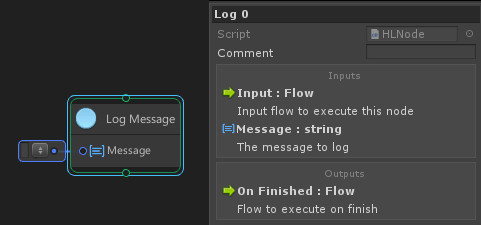
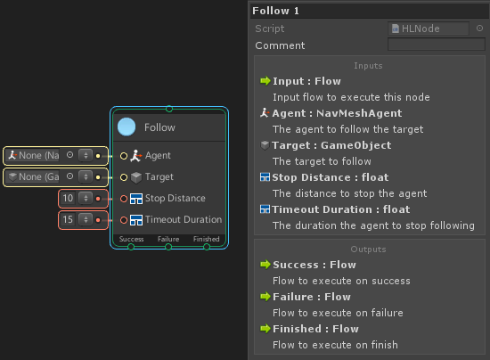
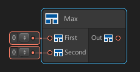

# Creating Custom Node

There are three possible ways you are able to create nodes in uNode:
1. Automatically through reflection.
2. Coding using High Level API.
   A simples and the most easy way to creating custom node by using HL API you can use the type you are already know and don’t have to worry about the code generation, uNode will handle it automatically.
3. Coding using Low Level API ( Currently is undocumented ).
   By using LL API you can full control how the node behave: controlling each port, node styling, and how it behave at runtime but you will need to creating both logic for running in reflection mode and native c# and make sure that’s will behave same at using reflection or native c# mode so you will need to be very carefull when using LL API.

## Creating Nodes using High Level API

Creating Nodes using HL API is the most easy and direct way of creating custom nodes for uNode. To do so, you need to derive from one of the available types.
<br>For more easy create custom node you can use [Node Creator Wizard](../user-interfaces/node-creator-wizard.md).

### IInstanceNode

Implement `IInstanceNode` to create node that can use multiple input and output for both flow and value ports.

> [!NOTE]
> When creating ports use variable with type: `ValuePortDefinition` for input data and `FlowPortDefinition` for a flow output.


#### Creating Data Input
To create a new data input port, you must add `Input` attribute to a variable and you must specify the type of port to the `Input` attribute.

Examples:
```cs
[Input(typeof(bool))]
public ValuePortDefinition myInputData;
```

> [!NOTE]
> Usage without using `ValuePortDefinition` is possible but not recommended as the `IInstanceNode` is not dirrectly manipulating the input value, using `ValuePortDefinition` is recommended as it is empty struct.

#### Creating Data Output
To create a new data ouput port, you must add `Output` attribute to a variable or function.
If you place to a function, you can add any number of parameter to get the input data but an `ref/out` parameter modifier is not currently supported.

Examples to create output data that dirrectly get the value:
```cs
[Output]
public float myOutputValue;
```

Examples to create output data from function that invoke the function to get the value:
```cs
[Input(typeof(float))]
public ValuePortDefinition first;
[Input(typeof(float))]
public ValuePortDefinition second;

[Output]
public float GetValue(float first, float second) { 
  return first + second;
}
```

#### Creating Flow Input
To create a new flow input port, you must add `Input` attribute to a function.

Examples to create one flow input:
```cs
[Input]
public void Execute() { 
  //Logic here
}
```

You can also add any number of function parameter to get's an input data, but you must declare the input port and the parameter name must match to the input data port.

Examples to create two flow input, one output data and three input data:
```cs
[Input(typeof(float))]
public ValuePortDefinition first;
[Input(typeof(float))]
public ValuePortDefinition second;
[Input(typeof(float))]
public ValuePortDefinition third;
[Output]
public float value;

[Input("Add")]
public void LogAdd(float first, float second) { 
  Debug.Log(first + second);
}

[Input("Multiple")]
public void LogMul(float first, float second, float third) { 
  value = first * second * third;
  Debug.Log(value);
}
```

From the example there's 3 data input: `first`, `second` and `third`.
And there's a 2 input flow one is the `LogAdd` that only get the `first` and `second` input and leave the output `value` and `third` input untouched. And the other is `LogMul` that get all the input data and set the output data of `value`.

#### Creating Flow Output
To create a new flow output port, you must add `Output` attribute to a variable with type: `FlowPortDefinition`.
You can call the output by modify the `exit` of the `Input` attribute of the flow. 

Examples to create one flow input and execute the output right after `Execute` is invoked:
```cs
[Output("Next")]
public FlowPortDefinition exit;

[Input("", exit = nameof(exit))]
public void Execute() { 
  //Logic here
}
```

For advanced scenarios uNode also support calling of flow output based on condition.
There are 2 supported types (bool and enum) to create execution based on condition. Use bool if you want the port to executed when condition is true, and use the enum to create multiple output at once.

Examples to create one flow input and execute the output of `exit` when condition is `true` using bool:
```cs
[Output(type =typeof(bool))]
public FlowPortDefinition exit;

[Input("")]
public void Execute(bool condition, out bool exit) { 
  if(condition) {
    //This will execute the exit
		state = true;
	}
	else {
    //This will not execute the exit
		state = false;
	}
}
```

You can also use `PortDiscard` attribute and place it on the `Enum` member for uNode to not create the flow of that member.

Examples, it will not create the `None` port:
```cs
public enum Kind {
  [PortDiscard]
	None,
	One,
  Two,
}
```


#### Complete Examples

Log node:
```cs
using UnityEngine;

namespace MaxyGames.UNode.Nodes {
	[NodeMenu("Flow", "Log Message")] //Add the node to the menu
	public class LogMessage : IInstanceNode {
		[Input(typeof(string), description = "The message to log")]
		public ValuePortDefinition message;
		[Output]
		public FlowPortDefinition exit;

		[Input("", exit = nameof(exit))]
		public void Execute(string message) {
			Debug.Log(message);
		}
	}
}
```

Per Second node:
```cs
using UnityEngine;

namespace MaxyGames.UNode.Nodes {
	[NodeMenu("Value", "Per Second")] //Add the node to the menu
	public class GetPerSecond : IInstanceNode {
		[Input(type = typeof(float))]
		public ValuePortDefinition input;

		[Output("Out")]
		public float GetValue(float input) {
			return Time.deltaTime * input;
		}
	}
}
```

Once node:
```cs
using UnityEngine;

namespace MaxyGames.UNode.Nodes {
	[NodeMenu("Flow", "Once")]
	public class MyNode : IInstanceNode {
		[Output(type = typeof(Kind))]
		public FlowPortDefinition kind;

		private bool hasEnter = false;

		public enum Kind {
			[PortDescription(description = "The flow to execute only once at first time node get executed")]
			Once,
			[PortDescription(description = "The flow to execute after once the node is executed twice or more")]
			After
		}

		[Input("In", description = "The flow to execute the node")]
		public void Execute(out Kind kind) {
			if(!hasEnter) {
				hasEnter = true;
				kind = Kind.Once;
			}
			else {
				kind = Kind.After;
			}
		}

		[Input(description = "Reset the once state")]
		public void Reset() {
			hasEnter = false;
		}
	}
}
```

If node:
```cs
using UnityEngine;

namespace MaxyGames.UNode.Nodes {
  [NodeMenu("Flow", "My If")]
	public class TestIf : IInstanceNode {
		[Input(typeof(bool))]
		public ValuePortDefinition condition;
		[Output(type =typeof(bool))]
		public FlowPortDefinition state;
		[Output("Next")]
		public FlowPortDefinition exit;

		[Input("", exit = nameof(exit))]
		public void Execute(bool condition, out bool state) {
			if(condition) {
				state = true;
			}
			else {
				state = false;
			}
		}
	}
}
```


### IStaticNode

Implement `IStaticNode` to create node that can use multiple input and output for both flow and value ports.
It behave same as `IInstanceNode` except intead of looking the instance members, this node will looking for static members. 

Examples:
```cs
using UnityEngine;

namespace MaxyGames.UNode.Nodes {
	[NodeMenu("Value", "Get Unscaled Time")] //Add the node to the menu
	public class GetUnscaledTime : IStaticNode {
		[Input(type = typeof(float))]
		public static ValuePortDefinition input;

		[Output]
		public static float Execute(float input) {
			return Time.unscaledDeltaTime * input;
		}
	}
}
```


```cs
using UnityEngine;

namespace MaxyGames.UNode.Nodes {
	[NodeMenu("Value", "Calculator")] //Add the node to the menu
	public class Calculator : IStaticNode {
		[Input(typeof(float))]
		public static ValuePortDefinition first;
		[Input(typeof(float))]
		public static ValuePortDefinition second;

		[Output("Add")]
		public static float Add(float first, float second) {
			return first + second;
		}

		[Output("Divide")]
		public static float Div(float first, float second) {
			return first / second;
		}

		[Output("Multiple")]
		public static float Mul(float first, float second) {
			return first * second;
		}

		[Output("Substract")]
		public static float Sub(float first, float second) {
			return first - second;
		}
	}
}
```

### IFlowNode

Implement `IFlowNode` to create flow node that has one input and output flow port. They usually perform logical decisions or operations/actions. They execute in a single frame, when triggered.  To implement it you must implement `void Execute(object graph)` method.

Examples:

Log a message to the console:

```cs
using UnityEngine;
namespace MaxyGames.UNode.Nodes {
	[NodeMenu("Flow", "Log Message")] //Add the node to the menu
	public class LogMessage : IFlowNode {
		[Input(description = "The message to log")]
		public string message;

		public void Execute(object graph) {
			Debug.Log(message);
		}
	}
}
```

Result Node:



### IStateNode

Implement `IStateNode` to create flow node that has one input and 3 output ( success, failure, finished ). The state node are just like an IF Node they are executed and compare the return state true or false. They execute in a single frame, when triggered. To implement it you must implement `bool Execute(object graph)` method.

Examples:

```cs
using UnityEngine;
namespace MaxyGames.UNode.Nodes {
  [NodeMenu("Flow", "Is All True")] //Add the node to the menu
	public class IsTrue : IStateNode {
		[Input]
		public bool first;
		[Input]
		public bool second;

		public bool Execute(object graph) {
			return first && second;
		}
	}
}
```

### ICoroutineNode

Implement `ICoroutineNode` to create coroutine node that has one input and output. They can execute in a multiple frame, when triggered.  To implement it you must implement `IEnumerable Execute(object graph)` method.


Examples:

```cs
using UnityEngine;
namespace MaxyGames.UNode.Nodes {
  [NodeMenu("Coroutine", "Wait for second", IsCoroutine = true)]
  public class WaitForSecond : ICoroutineNode {
    [Input]
    public float waitTime;

    public IEnumerable Execute(object graph) {
      yield return new WaitForSeconds(waitTime);
    }
  }
}
```

And:

```cs
using UnityEngine;

namespace MaxyGames.UNode.Nodes {
  [NodeMenu("Flow", "Animate Float", IsCoroutine = true)]
  public class AnimateFloat : ICoroutineNode {
    [Input]
    public AnimationCurve curve;
    [Input]
    public float time;
    [Input]
    public float speed;

    float currentTime;
    float endTime;

    public IEnumerable Execute(object graph) {
      currentTime = 0;
      endTime = curve.keys[curve.length - 1].time;
      while(currentTime < endTime) {
        currentTime += Time.deltaTime * speed;
        time = curve.Evaluate(currentTime);
        yield return null;
      }
    }
  }
}
```

### IStateCoroutineNode

Implement `IStateCoroutineNode` to create state node that can be run in multiple frame. The node will have one input and 3 output (success, failure, finished ). To implement it you must implement `IEnumerable Execute(object graph)` method.

Yield Commands:
- ```cs
	yield return break; 
	```
  will finish the coroutine with the success state and execute On Success flow.
- ```cs
	yield return true; and => yield return false;
	```
  will finish the coroutine with success state and execute On Success flow.

- ```cs
	yield return false; and => yield return “Failure”; 
	```
  will finish the coroutine with failure state and execute On Failure flow. <br> When the Execute function is finished without above command the node will finish with success state.

Examples:

Following object:
```cs
using UnityEngine;
using UnityEngine.AI;

namespace MaxyGames.UNode.Nodes {
  [NodeMenu("State", "Follow", IsCoroutine = true)] //Add the node to menu, and ensure the node is not available to non coroutine graph
	public class Follow : IStateCoroutineNode {
		[Input(description = "The agent to follow the target")]
		public NavMeshAgent agent;
		[Input(description = "The target to follow")]
		public GameObject target;
		[Input(description = "The distance to stop the agent")]
		public float stopDistance = 10;
		[Input(description = "The duration the agent to stop following")]
		public float timeoutDuration = 15;

		public IEnumerable Execute(object graph) {
			//Cache the current time
			float time = Time.time;
			//Move the agent
			agent.SetDestination(target.transform.position);
			while(true) {
				if(Vector3.Distance(agent.transform.position, target.transform.position) < stopDistance) {
					//Stop the agent if its in range
					agent.isStopped = true;
					//Return a success state, and this command should stop the coroutine.
					yield return true;
				}
				else if(Time.time - time > timeoutDuration) {
					//Stop the agent
					agent.isStopped = true;
					//Return a failure state, and this command should stop the coroutine.
					yield return false;
				}
				//Wait for the next frame
				yield return null;
			}
		}
	}
}
```

Result Node:



### DataNode<T>

Implement `DataNode<T>` to create data node with one output value and the T is the output type. They are executed only when an output value is read by another node. To implement it you must override `T GetValue(object graph)`.

Examples:
```cs
using UnityEngine;
namespace MaxyGames.UNode.Nodes {
  [NodeMenu("Data", "Max")]
  public class MaxNode : DataNode<float> {
    [Input]
    public float first;
    [Input]
    public float second;

    public override float GetValue(object graph) {
      return Mathf.Max(first, second);
    }
  }
}
```

Result Node:



