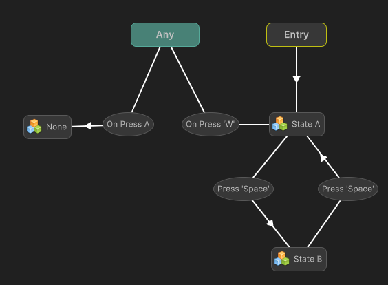
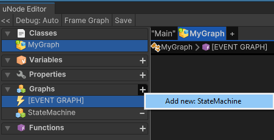

# 🧠 What is a State Machine?

A state machine is a system that can be in one state at a time, and it transitions between states based on certain conditions or events.

Example:
- Idle → Walk → Run → Jump → Fall → Idle
---

## 🔑 Key Node Types in uNode State Machines

| Node Type              | What It Does |
|------------------------|---------------|
| **Entry Node**         | The starting point of the state machine. This node runs first and activates the initial state. |
| **State Node**         | A block that contains behavior (like "Idle", "Attack", or "Walk"). Each one runs its own flow graph while it's active. |
| **Any State Node**     | A shortcut node that can jump to another state **from any other state**. Use this for things like "Death" or "Pause". |
| **Nested State Node** | A **State Graph** within a state, allowing hierarchical state machines or grouped logic. |

---

## 🕹 Example: Enemy AI State Machine

| State   | Behavior                           |
|---------|------------------------------------|
| Idle    | Do nothing, wait for player.       |
| Chase   | Move toward the player.            |
| Attack  | If close enough, deal damage.      |
| Dead    | Stop all actions, play death anim. |

**Transitions:**

- `Idle → Chase` (when player detected)
- `Chase → Attack` (when in range)
- `Any → Dead` (when health ≤ 0)

---

## 🎮 Common Use Cases

- Character AI behavior
- Game menus (`Main Menu → Settings → Credits`)
- Game state flow (`Loading → Playing → Paused → Game Over`)
- Animation logic

---

## 📦 How to Create State Machine

1. Go to `Assets > Create > uNode > Create New Graph` and chose graph to `Class Definition` or `C# > Mono Behaviour` and save it
2. Open the **Created Graph**, then click on the **+** in graph section then select `State Machine`.
3. 

---

### 🧩 Adding State Nodes

You can add different types of state nodes by right-clicking on the **State Machine canvas**:

| Action | Result |
|--------|--------|
| **Right-click** on empty space → `State` | Creates a **State Node** |
| **Right-click** on empty space → `Any State` | Adds a special **Any State Node** |
| **Right-click** on empty space → `Nested State` | Adds a **Nested (Super) State Node** |

---

### 🔁 Creating Transitions Between States

You must first **create a Transition**, then **connect it** to another state.

#### ✅ To Add a Transition:
1. **Right-click** on a **State Node**
2. Select **"Add Transition"** > and select the transition
3. A **Transition node** will appear connected to the state

#### 🔗 To Connect the Transition:
1. **Right-click** on the **Transition node**
2. Select **"Make Connection"**
3. Then **click on the target State Node** to connect it

> 📌 Note: Transitions **must go through** a transition node. You can’t connect states directly.

---

## 🔁 Editing a Transition Node

Each **Transition Node** can also have its own logic—this controls **when** the transition should occur.

### 🔧 To edit a Transition:
1. **Double-click** the Transition Node  
   → This opens a **Flow Graph** for the transition.
2. Inside the graph, define the events for it can be run while state is active.
3. Then create a event for evaluate **condition** that must be true to activate the transition:
   - Use a **Branch (if)** node
   - Use **Compare** nodes (e.g., `Health ≤ 0`, `Distance < 5`)
   - Access class variables or call methods
   - Or simply make event: On Collosion Enter, On Button Click, etc to trigger the transition.
4. When the condition passes, connect it to the **"Trigger Transition"** node to complete the transition.

### 🧠 Example: Build a Simple FSM

1. Add an **Entry Node** (already there by default)
2. Right-click → Add `State` → Name it `Idle`
3. Right-click → Add `State` → Name it `Chase`
4. Right-click on `Idle` → Add `Transition` > `Input` > `On Keyboard Input` 
5. Right-click on the transition → `Make Connection` → Click on `Chase`
6. Repeat for other transitions (e.g., back to Idle or go to Attack)
7. Optionally add an **Any State** → connect it to `Dead`

---

## ✅ Tips
- Name your states clearly (`Idle`, `Chase`, `Attack`)
- You can add conditions to transitions using **Flow Graphs** inside the transition or simply by Triggering transition inside the State
- Nested States help **group** similar logic (like a Patrol state with sub-states)
- Each state can contain a **Flow Graph**, which executes logic while active.

---