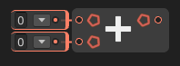

# ➕ Add Node

The **`Add` node** is used to perform an **addition operation** on numeric inputs. It takes two or more input values and outputs their sum.

### 🔧 How It Works

- Each input port represents a number to be added.
- The node calculates the **sum** of all connected inputs.
- The output is the **total result** of the addition.

### 📥 Inputs

| Port Name | Type     | Description                        |
|-----------|----------|------------------------------------|
| `A`       | `float`/`int`/`double` | First number to add      |
| `B`       | `float`/`int`/`double` | Second number to add     |
| *(Optional)* Additional Inputs | `float`/`int`/`double` | Any additional values to include in the sum |

### 📤 Output

| Port Name | Type     | Description                       |
|-----------|----------|-----------------------------------|
| `Result`  | Same as input type | The total of all added values |

> [!NOTE]
> - All inputs must be of compatible numeric types or any type that has addition operation like Vector2, Vector3, etc.
> - You can use the `Add` node for any numeric operation like adding positions, scores, or counters.