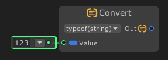

# As / Convert

The `Convert` node will convert the `value` input data into specific type.

The **`Convert` node** is used to convert a value from one type to another. This allows you to adapt data types dynamically — for example, converting an integer to a float, a number to a string, or a boolean to its string representation.

It functions similarly to type casting or the use of methods like `Convert.ToX()` in C#.

---

### 🔧 How It Works

- Accepts a single input value of any type.
- Attempts to convert that value into the desired output type.
- The result type depends on how the node is configured or what output connection is made.

---

### 📥 Inputs

| Port Name | Type   | Description                                 |
|-----------|--------|---------------------------------------------|
| `Value`   | Any    | The value to be converted                   |

---

### 📤 Outputs

| Port Name | Type   | Description                                 |
|-----------|--------|---------------------------------------------|
| `Out`  | Varies | The converted value in the desired type     |
