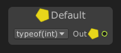

# Default

The **`Default` node** outputs the [default value](https://docs.microsoft.com/dotnet/csharp/language-reference/builtin-types/default-values) for a specified type.

### 🔧 How It Works

- You specify a **type** for the node (e.g., `int`, `float`, `string`, `bool`, or a custom class).
- The node returns that type's **default value**:
  - For value types (e.g., `int`, `float`, `bool`), this is typically `0`, `false`, etc.
  - For reference types (e.g., `string`, `object`, custom classes), this is `null`.

### 🛠 Type Setting

- The target type is selected in the **Inspector** when the node is selected.
- Once the type is set, the output will always return its default value.

### 📤 Output

| Port Name | Type   | Description                            |
|-----------|--------|----------------------------------------|
| `Result`  | Any    | The default value for the selected type |