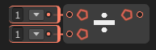

# ➗ Divide Node

The **`Divide` node** performs a **division operation** between numeric input values. It divides the first input by the second (and optionally more) inputs and outputs the result.

### 🔧 How It Works

- The node divides the value of the first input by the second.
- If more inputs are connected, the division continues sequentially:  
  `A / B / C ...`
- The result is the **quotient** of the division chain.

### ⚠️ Division by Zero

- If any divisor (other than the first input) is zero, the result will be `Infinity`, `NaN`, or trigger an error depending on the platform.
- Always ensure divisor inputs are **non-zero** when performing division.

### 📥 Inputs

| Port Name | Type             | Description                         |
|-----------|------------------|-------------------------------------|
| `A`       | `float`/`int`/`double` | The numerator (value to divide)     |
| `B`       | `float`/`int`/`double` | The denominator (divides `A`)       |
| *(Optional)* Additional Inputs | `float`/`int`/`double` | Further values to divide the result by |

### 📤 Output

| Port Name | Type             | Description                         |
|-----------|------------------|-------------------------------------|
| `Result`  | Same as input type | The final quotient after division  |
