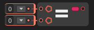

# Equal

The **`Equal` node** performs a **value comparison** between two inputs. It returns `true` if both values are **equal**, and `false` otherwise.

### 🔧 How It Works

- The node compares input `A` with input `B`.
- If the values are the same, the result is `true`.
- If they differ in value, the result is `false`.

### 📥 Inputs

| Port Name | Type     | Description                         |
|-----------|----------|-------------------------------------|
| `A`       | Any      | First value to compare              |
| `B`       | Any      | Second value to compare             |

### 📤 Output

| Port Name | Type  | Description                         |
|-----------|-------|-------------------------------------|
| `Result`  | `bool`| `true` if A equals B, otherwise `false` |