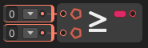

# Greater Than Or Equal

The **`Greater Than Or Equal` node** compares two numeric values and returns `true` if the first value is **greater than or equal to** the second. Otherwise, it returns `false`.

### 🔧 How It Works

- The node evaluates: `A >= B`
- If `A` is greater than or equal to `B`, the result is `true`.
- If `A` is less than `B`, the result is `false`.

This node is useful when you want to allow a value to meet or exceed a condition, such as reaching a score threshold or limiting input ranges.

### 📥 Inputs

| Port Name | Type               | Description                                    |
|-----------|--------------------|------------------------------------------------|
| `A`       | `int` / `float` / `double` | First value (left-hand side of `>=`)             |
| `B`       | `int` / `float` / `double` | Second value (right-hand side of `>=`)            |

### 📤 Output

| Port Name | Type  | Description                                             |
|-----------|-------|---------------------------------------------------------|
| `Result`  | `bool`| `true` if A is greater than or equal to B, else `false` |