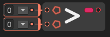

# Greater Than

The **`Greater Than` node** compares two numeric values and returns `true` if the first value is **greater than** the second. Otherwise, it returns `false`.

### 🔧 How It Works

- The node evaluates: `A > B`
- If `A` is greater than `B`, the result is `true`.
- If `A` is equal to or less than `B`, the result is `false`.

This node is commonly used to check for thresholds, overflows, or to trigger logic when a value exceeds a certain limit.

### 📥 Inputs

| Port Name | Type               | Description                                 |
|-----------|--------------------|---------------------------------------------|
| `A`       | `int` / `float` / `double` | First value (left-hand side of `>`)          |
| `B`       | `int` / `float` / `double` | Second value (right-hand side of `>`)         |

### 📤 Output

| Port Name | Type  | Description                                      |
|-----------|-------|--------------------------------------------------|
| `Result`  | `bool`| `true` if A is greater than B, otherwise `false` |

> [!NOTE]
> - Commonly used for conditions such as "if score > highScore" or "if speed > maxSpeed".