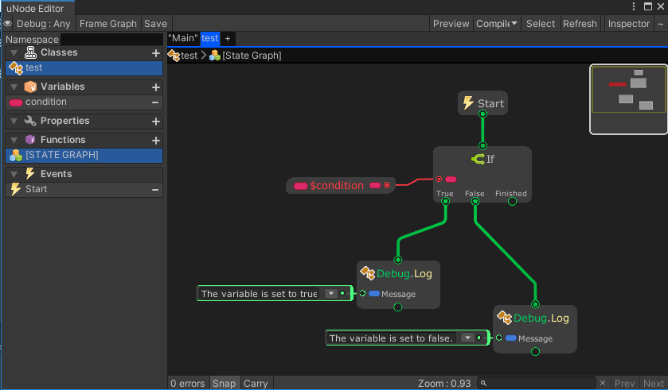

# If


The **`If` node** is a conditional branching node used to control logic flow based on whether a specified condition is `true` or `false`. 

This node is essential for decision-making, allowing you to execute different sets of nodes depending on the result of a boolean condition.

---

### 🔧 How It Works

- The node evaluates a boolean condition.
- If the condition is `true`, it executes the nodes connected to the **True** output.
- If the condition is `false`, it executes the nodes connected to the **False** output.

---

### 📥 Inputs

| Port Name   | Type   | Description                                 |
|-------------|--------|---------------------------------------------|
| `Condition` | Bool   | The boolean expression to evaluate          |
| `Flow`      | Flow   | Execution flow input                        |

---

### 📤 Outputs

| Port Name | Type   | Description                                           |
|-----------|--------|-------------------------------------------------------|
| `True`    | Flow   | Executed if the condition evaluates to `true`         |
| `False`   | Flow   | Executed if the condition evaluates to `false`        |
| `Next`   | Flow   | Executed after `True` or `False` flow is evaluated        |

---

## Examples

Graph:


Generated script:
```cs
using UnityEngine;
using System.Collections;
using System.Collections.Generic;
public class test : MonoBehaviour {
	public bool condition = true;
	public void Update() {
		if(condition) {
			Debug.Log("The variable is set to true.");
		} else {
			Debug.Log("The variable is set to false.");
		}
	}
}
```

Output:
```
The variable is set to true.
```