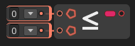

# Less Than Or Equal

The **`Less Than Or Equal` node** compares two numeric values and returns `true` if the first value is **less than or equal to** the second. Otherwise, it returns `false`.

### 🔧 How It Works

- The node evaluates: `A <= B`
- If `A` is **less than** or **equal to** `B`, the result is `true`.
- If `A` is greater than `B`, the result is `false`.

This node is useful for boundary checks, limiting values, and conditional branching based on thresholds.

### 📥 Inputs

| Port Name | Type               | Description                                  |
|-----------|--------------------|----------------------------------------------|
| `A`       | `int` / `float` / `double` | First value (left-hand side of `<=`)         |
| `B`       | `int` / `float` / `double` | Second value (right-hand side of `<=`)       |

### 📤 Output

| Port Name | Type  | Description                                         |
|-----------|-------|-----------------------------------------------------|
| `Result`  | `bool`| `true` if A is less than or equal to B, else `false` |