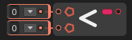

# Less Than

The **`Less Than` node** compares two numeric values and returns `true` if the first value is **less than** the second. Otherwise, it returns `false`.

### 🔧 How It Works

- The node checks whether `A < B`.
- If `A` is less than `B`, the output is `true`.
- If `A` is equal to or greater than `B`, the output is `false`.

This node is commonly used for numeric comparisons, thresholds, sorting, and conditional logic.

### 📥 Inputs

| Port Name | Type               | Description                            |
|-----------|--------------------|----------------------------------------|
| `A`       | `int` / `float` / `double` | First value (left-hand side of `<`)     |
| `B`       | `int` / `float` / `double` | Second value (right-hand side of `<`)  |

### 📤 Output

| Port Name | Type  | Description                                 |
|-----------|-------|---------------------------------------------|
| `Result`  | `bool`| `true` if A is less than B, otherwise `false` |