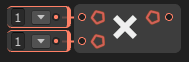

# ✖️ Multiply Node

The **`Multiply` node** performs a **multiplication operation** on two or more numeric input values. It returns the **product** of all connected inputs.

### 🔧 How It Works

- The node multiplies all connected input values in sequence:
  `A × B × C ...`
- The result is the **total product** of all inputs.

### 📥 Inputs

| Port Name | Type               | Description                              |
|-----------|--------------------|------------------------------------------|
| `A`       | `float` / `int` / `double` | First value to multiply                 |
| `B`       | `float` / `int` / `double` | Second value to multiply                |
| *(Optional)* Additional Inputs | `float` / `int` / `double` | Any additional values to include in the product |

### 📤 Output

| Port Name | Type               | Description                   |
|-----------|--------------------|-------------------------------|
| `Result`  | Same as input type | The result of the multiplication |

### 📌 Notes

- Inputs must be of compatible numeric types.
- If any input is `0`, the result will always be `0`.
- Useful for calculations like scaling, damage formulas, or total cost.