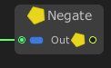

# Negate

The **`Negate` node** returns the **negative value** of a numeric input. It effectively multiplies the input by `-1`.

### 🔧 How It Works

- Takes a single numeric input (`A`).
- Outputs the **negated** (inverted sign) value: `-A`.
- Converts positive values to negative, and negative values to positive.

This node is useful for reversing directions, subtracting from zero, or inverting forces, velocities, or offsets.

### 📥 Input

| Port Name | Type               | Description                       |
|-----------|--------------------|-----------------------------------|
| `A`       | `int` / `float` / `double` | The numeric value to negate        |

### 📤 Output

| Port Name | Type               | Description                         |
|-----------|--------------------|-------------------------------------|
| `Result`  | Same as input type | The negative of the input value     |