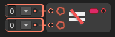

# Not Equal

The **`Not Equal` node** checks whether two input values are **not equal**. It returns `true` if the values are different, and `false` if they are the same.

### 🔧 How It Works

- The node compares input `A` with input `B`.
- If the values are **not the same**, the result is `true`.
- If the values are **equal**, the result is `false`.

### 📥 Inputs

| Port Name | Type | Description                        |
|-----------|------|------------------------------------|
| `A`       | Any  | First value to compare             |
| `B`       | Any  | Second value to compare            |

### 📤 Output

| Port Name | Type  | Description                              |
|-----------|-------|------------------------------------------|
| `Result`  | `bool`| `true` if A is not equal to B, otherwise `false` |