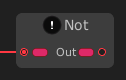

# Not

The **`Not` node** performs a **logical negation** (also known as a **Boolean NOT**). It takes a single `bool` input and returns the **inverse** of its value.

### 🔧 How It Works

- If the input is `true`, the output will be `false`.
- If the input is `false`, the output will be `true`.

This node is useful for inverting conditions, toggling Boolean values, or building complex logic branches.

### 📥 Input

| Port Name | Type  | Description                   |
|-----------|-------|-------------------------------|
| `Input`   | `bool`| The Boolean value to negate   |

### 📤 Output

| Port Name | Type  | Description                       |
|-----------|-------|-----------------------------------|
| `Result`  | `bool`| The opposite of the input value   |