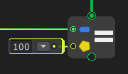

# SetValue



The **`SetValue` node** is used to **assign a value** to a target variable, or property. It updates the target with the specified input and continues execution after the assignment.

### 🔧 How It Works

- You provide a **target** (e.g., a variable, or property).
- You provide a **value** that will be assigned to the target.
- The node sets the value and then triggers the **Next** output for flow continuation.

### 📥 Inputs

| Port Name | Type   | Description                             |
|-----------|--------|-----------------------------------------|
| `Target`  | Any    | The variable, property, or field to set |
| `Value`   | Any    | The value to assign to the target       |

### ▶️ Control Flow

| Port Name | Description                         |
|-----------|-------------------------------------|
| `Input`   | Flow input to trigger the node      |
| `Next`    | Flow output after value is assigned |


## Examples

Graph:


Generated script:
```cs
#pragma warning disable
using UnityEngine;
using System.Collections.Generic;

public class test : MonoBehaviour {
	public int variable1 = 0;

	void Start() {
		Debug.Log(variable1);
		variable1 = 100;
		Debug.Log(variable1);
	}
}
```

Output:
```
0
100
```