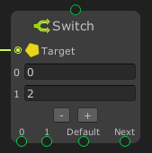

# Switch

The **`Switch` node** is a conditional branching node that selects one of multiple execution paths or values based on the input value. It mimics the behavior of the `switch` statement in C#.

This node is useful when you need to choose between many options based on a single value.

---

### 🔧 How It Works

- Takes an **input value** and compares it against a set of **case values**.
- If a match is found, the corresponding output is triggered.
- If no case matches, the **default** output (if defined) is used.

---

### 📥 Inputs

| Port Name | Type     | Description                      |
|-----------|----------|----------------------------------|
| `Target`   | String or Primitive Type      | The value to compare against cases |

---

### 📤 Outputs

Each **case** adds a new output:

| Output Name   | Description                                          |
|---------------|------------------------------------------------------|
| `Case X`      | Triggered when `Target` matches value `X`             |
| `Default`     | Triggered when no cases match (optional fallback)    |