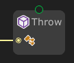

# Throw

The **`Throw` node** is used to **manually raise an exception** (error) during graph execution. This is useful for stopping execution when an unexpected condition occurs, or for debugging and validation purposes.

It behaves similarly to the `throw` statement in C#.

---

### 🔧 How It Works

- Takes an input of type `Exception` or a message (string) to create and throw a runtime exception.
- When executed, it interrupts the flow and throws the exception immediately.
- If uncaught, the exception halts the graph or the application (just like standard C# behavior).

---

### 📥 Inputs

| Port Name  | Type        | Description                                 |
|------------|-------------|---------------------------------------------|
| `Value` | `Exception` | The exception to throw |

---

### 📤 Outputs

None — execution is halted when this node is triggered.

---
