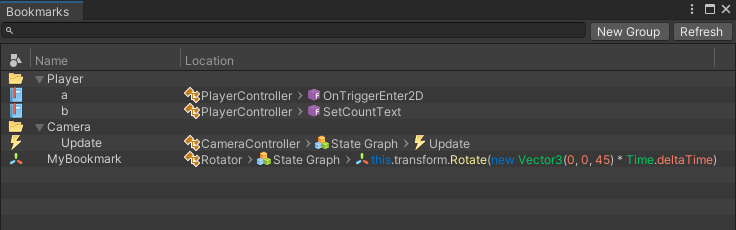

# Bookmarks

With Bookmarks you can create named Bookmarks in any function graph in the uNode Editor. This bookmark will capture the position and zoom level of the canvas for easy navigate to the mostly edited graph. Bookmarks are stored locally in `MyProject/uNode3Data/Bookmarks.asset`, so they won't affect the graph itself, and syncing your content will not overwrite your Bookmarks with another user's Bookmarks but can if you want.

## Creating Bookmarks

To create a Bookmark:
1. With the Graph and Zoom position you wish to Bookmark, right click on the canvas and select `Add Bookmark`.
2. In the New Bookmark dialog box, enter your desired name and click the `Add` button. 

## Viewing and Using Bookmarks

To view or use a previously created Bookmark, navigate to menu: `Tools > uNode > Bookmarks`.
This will open the Bookmarks menu that displays all the Bookmarks.

For Bookmarks displayed in the window, you can right-click on a Bookmark to show additional options ( Edit, Open, and Remove ).

Double-click on a Bookmark will jump to that section of your Graph.