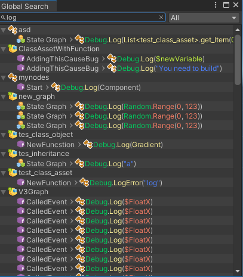

# Global Search

With Global Search tool you can search graph, variable, property, function and nodes in the project.

You can open the global search by navigating to menu: `Tools > uNdoe > Global Search`.