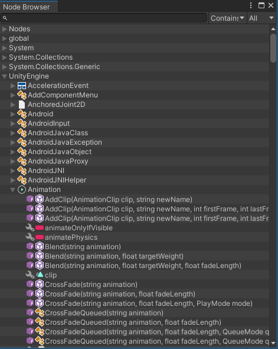

# Node Browser

With Node Browser tool you can find any nodes to add to the graph canvas.

You can open the graph hierarchy by navigating to menu: `Tools > uNode > Node Browser`.
Dragging & droping the item in browser to the canvas will add a new node to the graph.